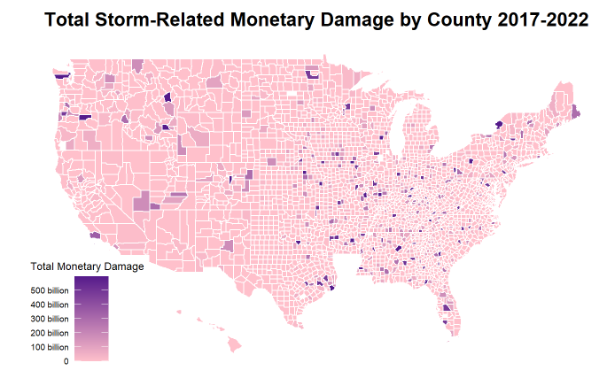
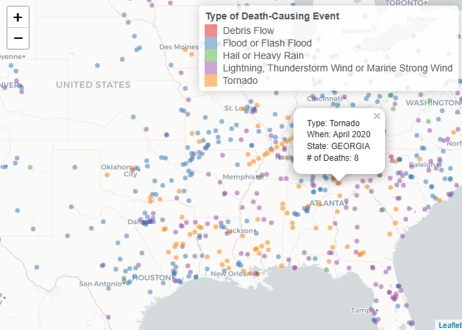
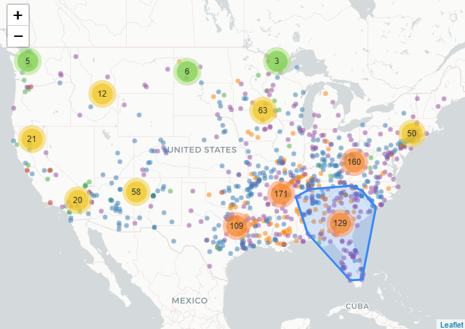
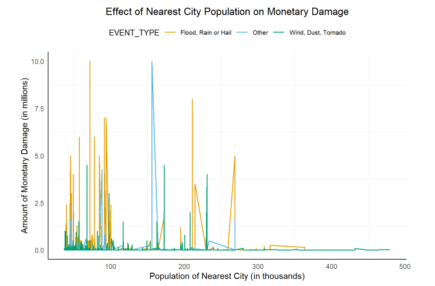

# mapping_weather
Mapping storms and severe weather events across continental U.S.

This is one of my grad school projects coded in R, completed in my Data Visualization course spring of 2024. I explored the impacts of severe weather events in the continental US using NOAA’s National Centers for Environmental Information (NCEI) data.
I mapped storm damage (monetary, injury, deaths, etc.) by state, county, density, and also created choropleth maps as well as interactive density and cluster maps using leaflet to explore impacts of each weather event. Lastly, I took a sample of the severe weather events dataset and identified the nearest large city, exploring relationship between impact and nearest large city population.

## Key Findings and Visual Highlights

The three states that experienced the highest monetary damage amounts associated with extreme weather events between 2017 and 2022 were Texas, Louisiana, and Florida. 

Individual counties that experienced the highest monetary damage amounts are more spread out - they are not just concentrated within the most damaged states.

The interactive map I developed using leaflet allows users to investigate death-causing severe weather events between 2017 and 2022 (each represented by a point on the map). Colors represent event type. Users can hover over a point to investigate when and where the event occured as well as how many deaths it caused. Lightning and Thunderstorms, Tornadoes, and Floods/Flash Floods seem to dominate the area of the map shown below.

I then added a clustering feature to above map.

Lastly, I visualized the effect of the nearest city population to the storm location on monetary damage caused by the storm. The plot below does not suggest a clear trend, although flood, rain, or hail (orange) events seem to most frequently be the cause of significant monetary damage (with one large damage event being from the “other” category). We see that the cluster of higher monetary damage spikes is towards the smaller population size end of the graph (lefthand side) so maybe smaller cities generally have less advanced infrastructure and funding to sufficiently prepare for the consequences of extreme weather events, resulting in more frequent high-cost damage.

