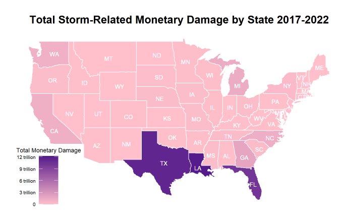

# mapping_weather
Mapping storms and severe weather events across continental U.S.

This is one of my grad school projects coded in R, completed in my Data Visualization course spring of 2024. I explored the impacts of severe weather events in the continental US using NOAA’s National Centers for Environmental Information (NCEI) data.
I mapped storm damage (monetary, injury, deaths, etc.) by state, county, density, and also created choropleth maps as well as interactive density and cluster maps using leaflet to explore impacts of each weather event. Lastly, I took a sample of the severe weather events dataset and identified the nearest large city, exploring relationship between impact and nearest large city population.

## Key Findings and Visuals

The three states that experienced the highest monetary damage amounts associated with extreme weather events between 2017 and 2022 were Texas, Louisiana, and Florida. 

